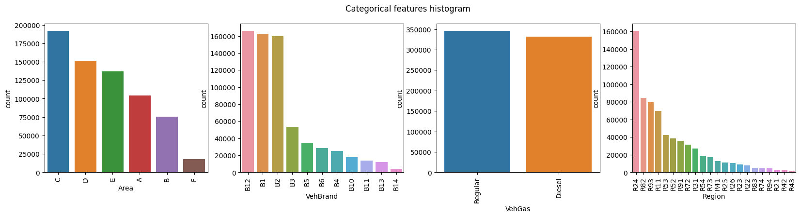
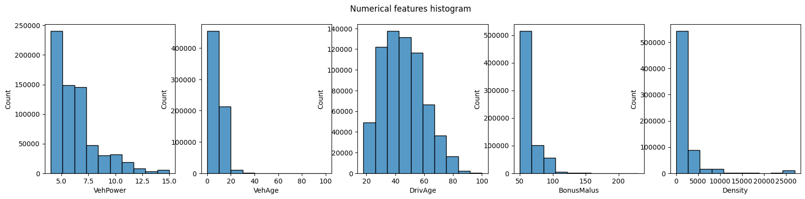
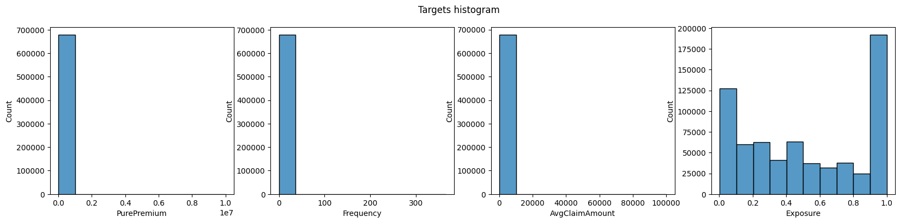
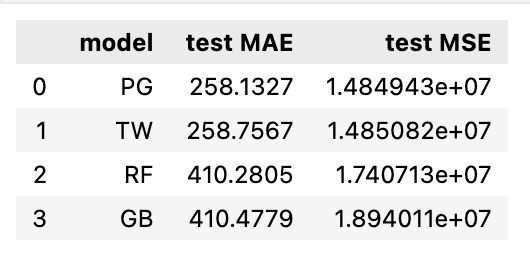

# Background
Assume that a policyholder has *n* risk factors, such as age, gender, vehicle type, and vehicle age. A $$1 \times n$$ vector would then represent his/her unique set of risk factors. Let $X \in \mathbb{R}^n$ be the space of all such vectors. The insurance ratemaking process seeks to determine a policyholder's projected claim cost, often known as **the expected risk premium**.

Let *P* denote the expected risk premium for a particular policyholder. The goal of statistical learning is to approximate the function $f(x)=E[P|X=x]$ that can model this expected risk premium.

In practice, a wide range of models such as linear regression, generalized linear models, mixture models, decision trees, artificial neural networks, support vector machines, XGBoost can be fitted to car insurance data with the purpose of predicting the expected risk premium given a certain set of input variables. 

In this project we investigate the performance of some of these models on a well-known data set called "French Motor Claims Datasets".

# Data sets
- 'freMTPL2freq' (id=41214) is a dataset with insurance policies per row. Every row has a policy id (IDpol), the time under insurance cover in years (Exposure), the number of claims (ClaimNb) and several features (Area, VehPower, VehAge, DrivAge, BonusMalus, VehBrand, VehGas, Density, Region).

- 'freMTPL2sev' (id=41215) lists all claims, one claim per row. It has the the columns policy id (IDpol) and claim amount (ClaimAmount). 

For a detailed description of the data, see http://dutangc.free.fr/pub/RRepos/web/CASdatasets-index.html. For an excellent exploratory data analysis, see the case study paper.

## Categorical variables

* *Area*: area code (categorical, ordinal)
* *VehBrand*: car brand (categorical, nominal)
* *VehGas*: diesel or regular fuel car (binary)
* *Region*: regions in France (prior to 2016) (categorical)

## Numerical variables

* *VehAge*: age of the car in years
* *DrivAge*: age of the (most common) driver in years
* *BonusMalus*: bonus-malus level between 50 and 230 (with reference level 100)
* *Density*: density of inhabitants per km2 in the city of the living place of the driver
* *VehPower*: power of the car (categorical, ordinal)

## Target-related variables

* *ClaimNb*: number of claims on the given policy
* *Exposure*: total exposure in yearly units
* *ClaimAmount*: claim amount 

Also following target values are created for modeling purposes:
* *PurePremium*: the expected total claim amount per unit of exposure
* *Frequency*: claim number per unit of exposure 
* *AvgClaimAmount*: average claim amount

# Data Pre-processing
To ensure high-quality data, it's crucial to preprocess it. To make the process easier, the data preprocessing is divided into four stages: 
- **Data Cleaning** involves filling of missing values, smoothing or removing noisy data and outliers along with resolving inconsistencies.
- **Data Integration** involves integrating data from multiple sources such as databases (relational and non-relational), data cubes, files, etc.
- **Data Transformation** involves one-hot encoding categorical variables and scaling/normalizing numerical variables. Before this step the data is splitted into train and test sets with 70/30 ratio to avoid data leakage.
- **Data Reduction** invloves reducing the number of attributes or dimensions (low variance filter, high correlation filtering, PCA, LDA, etc.)

# Models
## Poisson-Gamma and Tweedie
A common procedure for predicting the risk premium is to fit a GLM (A Poisson distributed GLM with logarithmic link function) with claim frequency [claims/year] as dependent variable and another GLM ( a gamma distributed GLM with logarithmic link function) with claim severity as dependent variable. The predictions from each model are then multiplied.

Another common method for modeling the risk premium is to fit a Tweedie distributed log-link GLM with risk premium as dependent variable. Tweedie distributions are distributions which have a variance function on
the form $Var(µ) = \mu^d$. Tweedie distributions for which $1<d<2$ are compound Poisson distributions which follow the distribution of a Poisson sum of gamma distributed random variables. This distribution has a point mass at zero. For values of d near 1 the distribution resembles a Poisson distribution, and for d near 2 the distribution resembles a gamma distribution. Since experience has proven that the Poisson and gamma distributions are suitable for modeling claim frequencies and claim severities respectively, the Tweedie distribution is a suitable choice for modeling the risk premium directly instead of modeling frequencies and severities apart.

# Preliminary Results
The MSE and MAE metrics for four models including Poisson-Gamma, Tweedie, Random Forest (RF) Regressor and Gradient Boosting (GB) Regressor models are presented in the following. 

# References
- [Tweedie regression on insurance claims](https://link-url-here.org)
- [Case Study: French Motor Third-Party Liability Claims](https://papers.ssrn.com/sol3/papers.cfm?abstract_id=3164764)
- [Python tutorial for the french motor third party liability 2 dataset](https://github.com/lorentzenchr/Tutorial_freMTPL2)

# To do
- Investigate the impact of feature selection/extraction on model performance
- Use gridsearch/randomsearch to optimize the hyper-parameters for ML models
